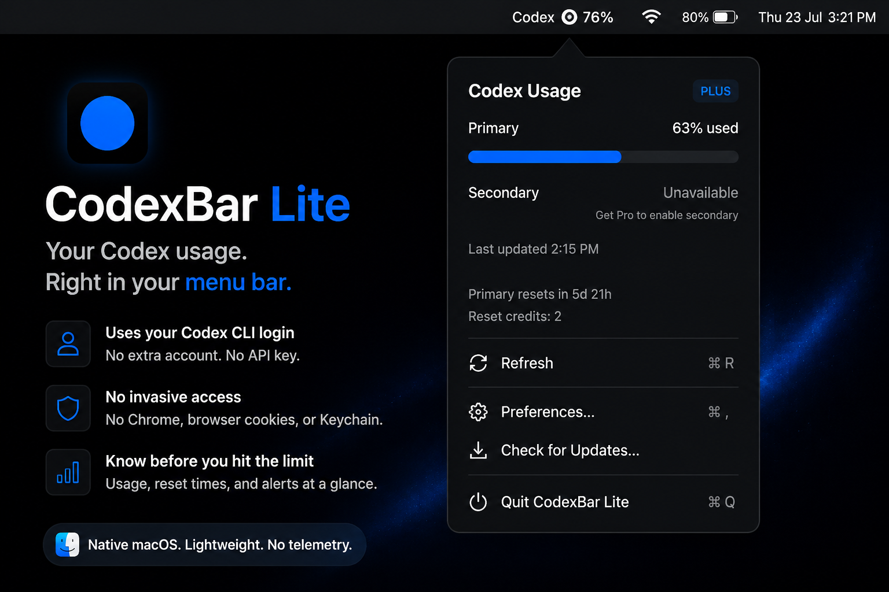

<h1 align="center">CodexBar Lite</h1>

<p align="center">
  <strong>Native OpenAI Codex usage tracker for your macOS menu bar.</strong><br>
  Uses the Codex CLI session already on your Mac.<br>
  No browser cookies. No Keychain access. No API keys. No third-party account.<br>
  <a href="https://getcodexbar.xyz"><strong>getcodexbar.xyz</strong></a>
</p>

> CodexBar Lite is an independent community project and is not affiliated with OpenAI.

<p align="center">
  <a href="https://github.com/wei-b0/codexbar-lite/releases/latest">
    
  </a>
</p>

<p align="center">
  
  
  
  
</p>

<p align="center">
  
</p>

## Why CodexBar Lite?

CodexBar Lite exists because checking usage should not require giving an app access to your browser, cookies, or unrelated system permissions.

It uses the existing Codex CLI session already created by `codex login` and only does what it needs: show your usage.

## Features

- Native macOS menu bar app
- Primary and secondary Codex usage windows with reset times
- Notifications at 80%, 90%, exhaustion, and credit reset
- Percentage used or percentage remaining - your choice
- Automatic refresh with cached usage when offline
- Launch at login and over-the-air updates with Sparkle
- No account required

No dashboards, browser extensions, graphs, themes, or account switching. CodexBar Lite stays small because the menu bar is all this job needs.

## Security model

Usage trackers often ask you to hand over access to sensitive parts of your Mac just to display a number.

> **CodexBar Lite does not need Chrome access, browser profiles, cookies, macOS Keychain, Accessibility, Screen Recording, Full Disk Access, or an API key.**

CodexBar Lite:

- Reads only `~/.codex/auth.json`
- Makes requests directly for your Codex usage
- Stores only local preferences and a usage cache

It does not:

- Access browser cookies or Chrome profiles
- Use the macOS Keychain
- Upload credentials to any third-party server
- Run telemetry or analytics

The session is used only to request your Codex usage from OpenAI's Codex service. Credentials are not sent to a third-party server or stored anywhere else by CodexBar Lite.

## How it works

Open the app. If no Codex session exists, CodexBar Lite launches `codex login` in Terminal and watches for completion. Usage appears automatically when login succeeds.

CodexBar Lite reads:

```text
~/.codex/auth.json
```

## Requirements

- macOS 13 Ventura or newer
- Apple Silicon Mac (arm64)
- Codex CLI installed

## Install

1. [Download the latest release](https://github.com/wei-b0/codexbar-lite/releases/download/v0.2.4/CodexBarLite-0.2.4-arm64.dmg).
2. Open the downloaded `.dmg`.
3. Drag CodexBar Lite into `/Applications`.
4. Open it.

Future versions install through **CodexBar Lite → Check for Updates…**.

## Preferences

- Refresh every 1, 5, 15, or 30 minutes
- Launch at Login
- Percentage used or remaining
- Automatic update checks
- Notification controls

<p align="center">
  
</p>

## Build from source

Requires Swift 5.10 or newer and Apple Command Line Tools.

```bash
swift build
./scripts/install.sh
```

Create a signed Sparkle release:

```bash
./scripts/release.sh <version> <build-number>
```

## Uninstall

Quit CodexBar Lite and move it from `/Applications` to Trash.

Optional local-data cleanup:

```bash
rm -rf ~/Library/Application\ Support/CodexBarLite
defaults delete dev.vaibhav.codexbar
```

## Independent by design

CodexBar Lite is an independent utility and is not affiliated with, endorsed by, or sponsored by OpenAI.
