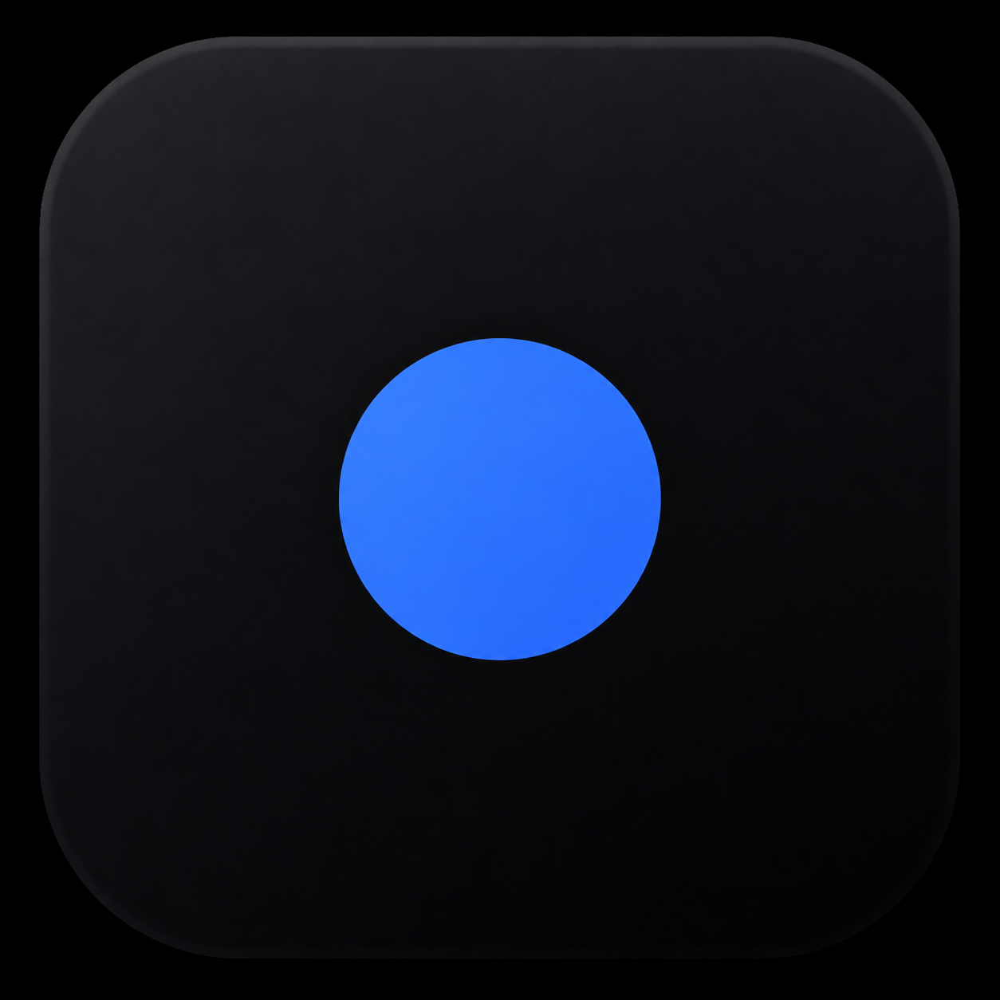
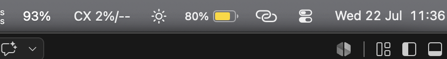
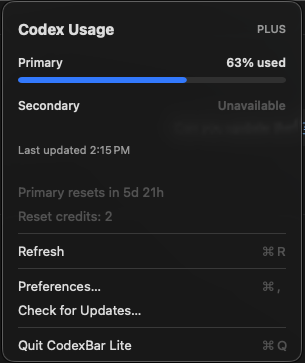
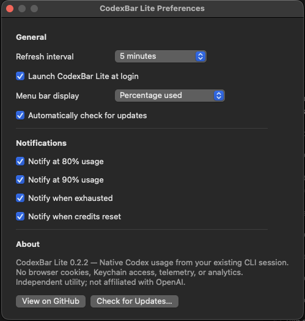

<p align="center">
  
</p>

<h1 align="center">CodexBar Lite</h1>

<p align="center">
  <strong>Native Codex usage in your macOS menu bar.</strong><br>
  Uses the Codex CLI session already on your Mac.<br>
  No browser cookies. No Keychain access. No API keys. No third-party account.
</p>

<p align="center">
  <a href="https://github.com/wei-b0/codexbar-lite/releases/latest">
    
  </a>
</p>

<p align="center">
  
  
  
  
</p>

<p align="center">
  
</p>

<p align="center">
  
  
</p>

## Your Codex login is enough

Usage trackers often ask you to hand over access to sensitive parts of your Mac just to display a number.

> **CodexBar Lite does not need Chrome access, browser profiles, cookies, macOS Keychain, Accessibility, Screen Recording, Full Disk Access, or an API key.**

It reads the same local session created by `codex login` and makes the minimum request needed to show your usage. There is no third-party backend, account, telemetry, or analytics.

- See primary and secondary usage with reset times
- Get notified at 80%, 90%, exhaustion, and credit reset
- Choose percentage used or percentage remaining
- Refresh automatically and fall back to cached usage when offline
- Launch at login and update over the air with Sparkle

No dashboards, browser extensions, graphs, themes, or account switching. CodexBar Lite stays small because the menu bar is all this job needs.

Open the app. If no Codex session exists, CodexBar Lite launches `codex login` in Terminal and watches for completion. Usage appears automatically when login succeeds.

CodexBar Lite reads:

```text
~/.codex/auth.json
```

The session is used only to request your Codex usage directly from `chatgpt.com`. Credentials are not sent to a third-party server or stored anywhere else by CodexBar Lite.

The app stores only preferences and a local usage cache. It contains no telemetry or analytics.

## Install

Requires an Apple Silicon Mac running macOS 13 Ventura or newer, with the Codex CLI installed.

1. [Download the latest release](https://github.com/wei-b0/codexbar-lite/releases/latest).
2. Move `CodexBarLite.app` to `/Applications`.
3. Open it.

Future versions install through **Codex → Check for Updates…**.

## Preferences

- Refresh every 1, 5, 15, or 30 minutes
- Launch at Login
- Percentage used or remaining
- Automatic update checks
- Notification controls

## Build from source

Requires Swift 5.10 or newer and Apple Command Line Tools.

```bash
swift build
./scripts/install.sh
```

Create a signed Sparkle release:

```bash
./scripts/release.sh <version> <build-number>
```

## Uninstall

Quit CodexBar Lite and move it from `/Applications` to Trash.

Optional local-data cleanup:

```bash
rm -rf ~/Library/Application\ Support/CodexBarLite
defaults delete dev.vaibhav.codexbar
```

## Independent by design

CodexBar Lite is an independent utility and is not affiliated with, endorsed by, or sponsored by OpenAI.
